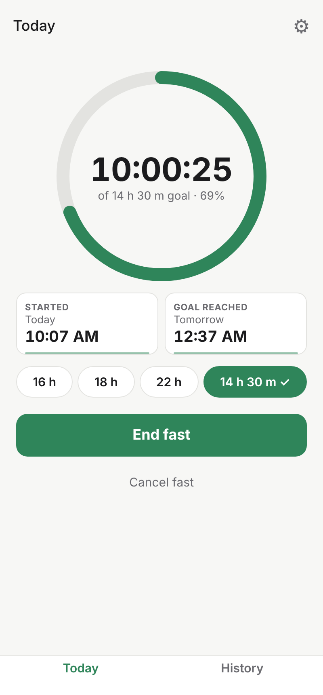
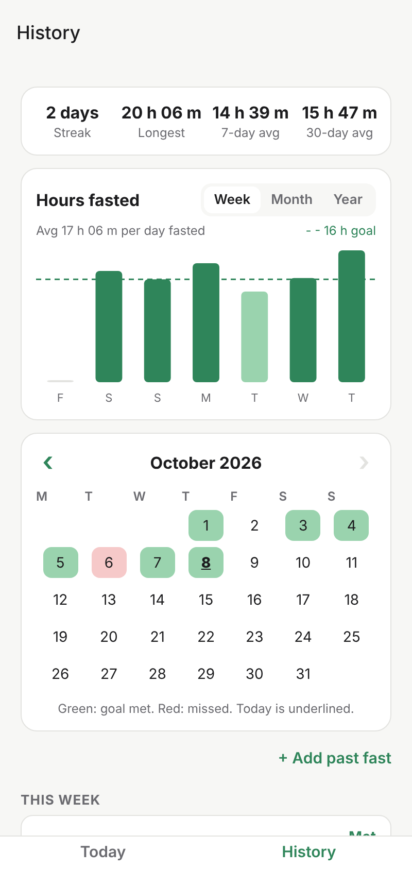
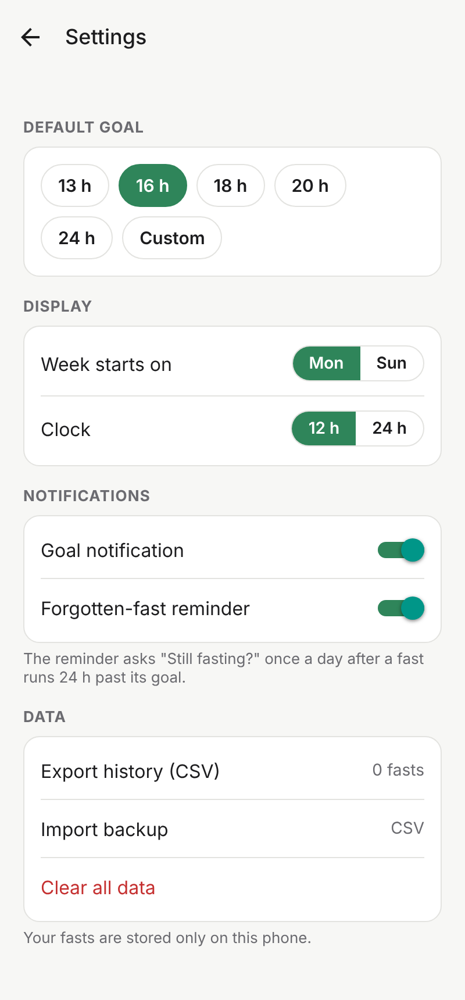

# Fasting Tracker

A simple intermittent fasting tracker for one person. Start a fast in one tap, watch a ring timer fill toward your goal, and end it when you eat. Every fast is kept in a history with a calendar, a streak and averages.

Built with [Expo](https://expo.dev) (React Native, TypeScript). It targets Android first; the same code can later ship to iOS and the web. All data stays on the phone.

| Today | History | Settings |
| --- | --- | --- |
|  |  |  |

## Features

- **Today:** pick a goal (16, 18, 22 h, or a custom goal up to 7 days), then Start and End each open a wheel picker set to now, so you can log the real time in one tap. A live ring shows progress; start time and goal-reached time sit side by side and can be changed (moving the goal-reached time changes the goal). Ending a fast that met its goal gets a confetti celebration. When idle it shows the time since your last fast.
- **History:** current streak, longest fast, 7 and 30-day averages, a chart of hours fasted (Week, Month, Year), a month calendar (green days met the goal, red days missed it), and fasts grouped by week. Tap a fast to edit its times, goal or note, or delete it. Add a missed fast by hand.
- **Settings** (gear on Today): default goal, week start day, 12/24 h clock, notification toggles, CSV export and import, clear all data.
- **Notifications:** one when the goal is reached, and a daily "Still fasting?" reminder with End and Keep going buttons once a fast runs 24 h past its goal. End lets you set the real end time.

Rules: only one fast runs at a time; a fast belongs to the day it ends on; it meets its goal when its duration is at least the goal; the streak counts consecutive days with a met fast, ending today or yesterday.

## Run it on your Android phone

1. Install [Node.js](https://nodejs.org) (LTS) and the **Expo Go** app from the Play Store.
2. In this folder run:
   ```bash
   npm install
   npm start
   ```
3. Scan the QR code in the terminal with Expo Go.

To install the app itself, download `fasting-tracker.apk` from the [latest release](https://github.com/gillien-cui/fasting-tracker/releases/tag/latest) on your phone and open it (Android will ask you to allow installs from your browser once). GitHub Actions builds it on every push to `main`; pull requests get the APK as a downloadable artifact on their workflow run.

`npm run web` runs it in a browser. Notifications are phone-only.

## Develop

```bash
npm test           # Jest, including the plan's automatic acceptance tests
npm run typecheck
npm run lint
```

- `src/app/` screens (Expo Router): `(tabs)/index.tsx` Today, `(tabs)/history.tsx`, `settings.tsx`, `fast/[id].tsx` edit/add, `end-fast.tsx`.
- `src/lib/actions.ts` start/end/edit/import rules, `fasts.ts` stats and formatting, `csv.ts` backup format, `db.ts` SQLite (expo-sqlite), `store.tsx` app state, `notifications.ts` scheduling.

CSV backups have the columns `id,started_at,ended_at,goal_minutes,note,status`, with times in UTC ISO format. Importing matches fasts by id, so importing the same file twice doesn't create duplicates.

## Acceptance tests

v1 is done when all 24 cases in the plan pass. The automatic ones (T4–T15, T17–T19 and the data part of T24) live in `src/lib/__tests__/acceptance.test.ts`, named by ID, and run in the America/New_York time zone so daylight saving is covered. Check these by hand on an Android phone:

- **T1** Start a 16 h fast: ring at 0%, start time and goal-reached time shown.
- **T2** Close the app for 2 h and reopen: elapsed time moved on 2 h.
- **T3** Restart the phone mid-fast: still running, correct elapsed time.
- **T16** Several fasts across weeks: grouped by week, newest first, Met/Missed shown.
- **T20** Calendar: met days filled, missed days outlined, today marked.
- **T21** Reach the goal with the app closed: one notification.
- **T22** Leave a fast running 24 h past its goal: "Still fasting?" arrives daily; End opens the end-time screen, Keep going dismisses it.
- **T23** End a fast early, or turn alerts off in Settings: no goal or reminder alerts for it.
- **T24** Export CSV, clear all data, import the file: history and stats look exactly as before.
- Works in airplane mode, and the APK installs and runs.
