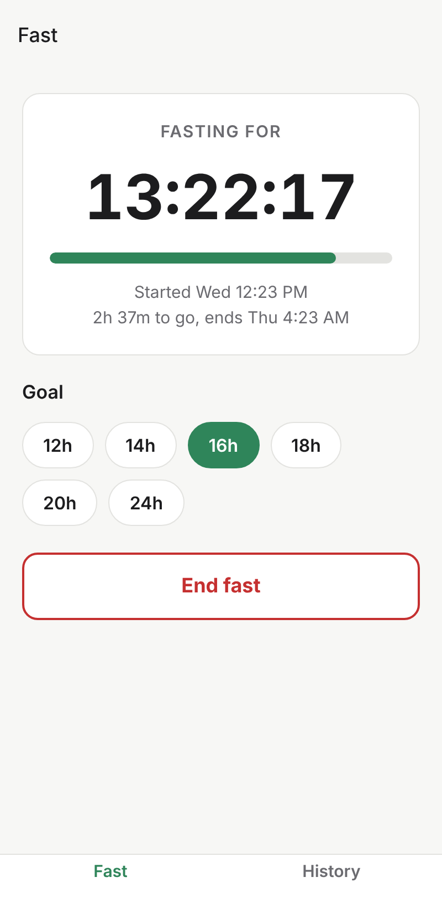

# Fasting Tracker

A simple intermittent fasting tracker. Start a fast when you finish eating, watch the timer count toward your goal, and end it when you eat again. Finished fasts are saved to a history list with a few stats.

Built with [Expo](https://expo.dev) (React Native, TypeScript), so it runs on Android today and can run on iOS and the web from the same code. Data is stored on the device only.

| Timer | History |
| --- | --- |
|  |  |

## Run it on your Android phone

1. Install [Node.js](https://nodejs.org) (LTS) and the **Expo Go** app from the Play Store.
2. In this folder run:
   ```bash
   npm install
   npm start
   ```
3. Scan the QR code in the terminal with Expo Go.

To run it in a browser instead, use `npm run web`.

## Develop

```bash
npm test          # unit tests for duration and stats logic
npm run typecheck
npm run lint
```

Screens live in `src/app/` (Expo Router), shared logic in `src/lib/`.
